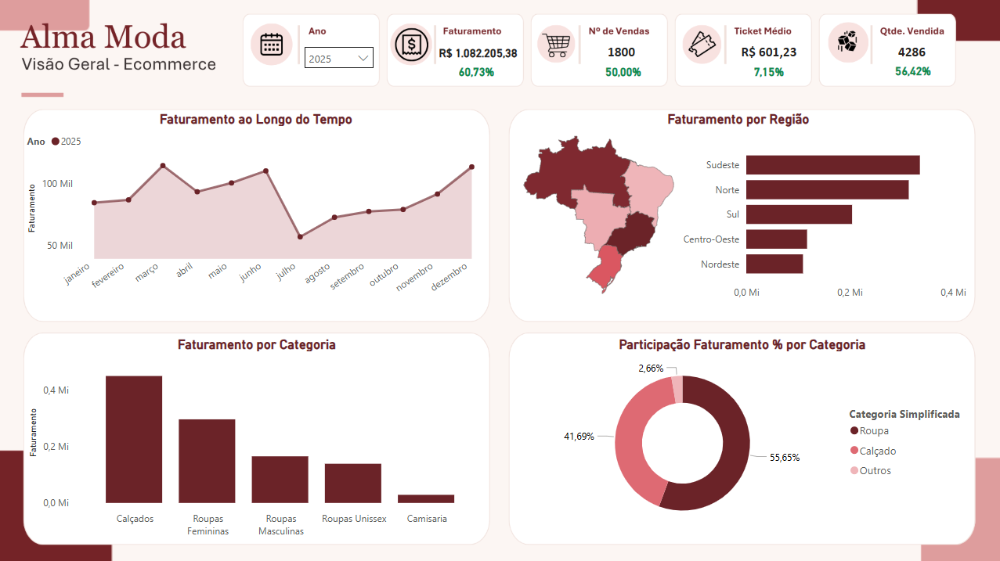
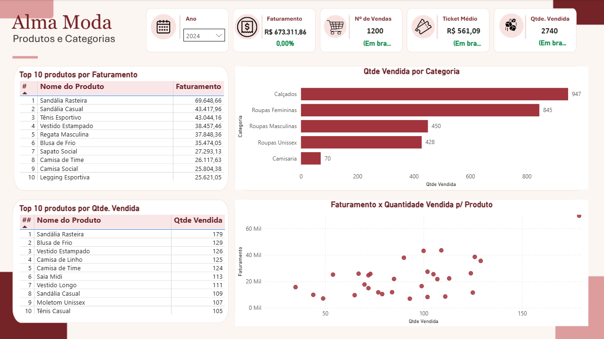
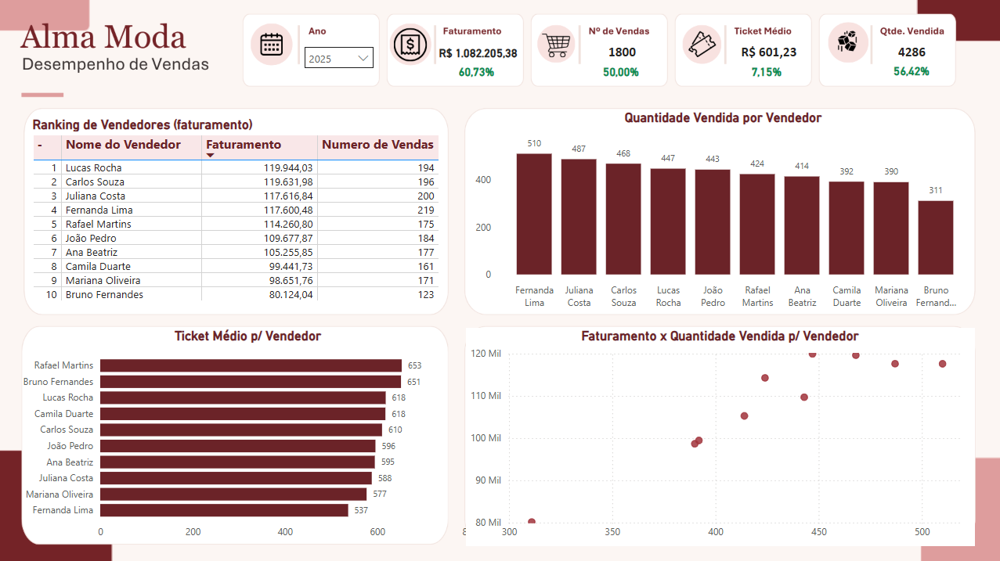

# Alma Moda — Dashboard de E-commerce no Power BI

Projeto de Business Intelligence desenvolvido no Power BI para análise de desempenho de um e-commerce fictício de moda feminina.

> Projeto de portfólio: a base de dados é sintética e foi estruturada a partir de uma base de vendas utilizada para fins de estudo.

## Objetivo

Criar um dashboard interativo capaz de responder as seguintes questões:

- faturamento;
- quantidade de vendas e itens vendidos;
- ticket médio;
- evolução das vendas ao longo do tempo;
- desempenho por região;
- desempenho por categoria;
- produtos mais vendidos;
- produtos com maior faturamento;
- desempenho dos vendedores;
- relação entre quantidade vendida e faturamento.

## Estrutura do projeto

```text
Alma-Moda-Power-BI/
│
├── README.md
│
├── dashboard/
│   └── Alma_Dashboard.pbix
│
├── dados/
│   └── Alma Moda - Planilha.xlsx
│
├── dax/
│   └── medidas.md
│
└── imagens/
    ├── visao-geral.png
    ├── produtos-categorias.png
    └── vendedores-desempenho.png
```

## Dashboard

### Visão Geral



### Produtos e Categorias



### Vendedores e Desempenho



## Modelo de dados

O modelo utiliza uma estrutura em estrela, separando a tabela fato das dimensões:

### Tabela fato
- `fVendas`

### Dimensões
- `dProdutos`
- `dCategorias`
- `dRegiao`
- `dVendedores`
- `dData`

A tabela `fVendas` concentra as transações e as dimensões fornecem os atributos utilizados para análise.

## Relacionamentos

- `dProdutos[Código]` → `fVendas[Código do Produto]`
- `dData[Data]` → `fVendas[Data da Venda]`
- `dCategorias[ID Categoria]` → `fVendas[ID Categoria]`
- `dRegiao[ID Região]` → `fVendas[ID Região]`
- `dVendedores[Matrícula]` → `fVendas[Matrícula do Vendedor]`

Os relacionamentos são do tipo 1:* e com direção de filtro da dimensão para a tabela fato.

## Páginas do dashboard

### 1. Visão Geral

Página destinada à visão executiva do negócio.

Principais indicadores:
- Faturamento
- Número de Vendas
- Ticket Médio
- Quantidade Vendida

Análises:
- faturamento ao longo do tempo;
- faturamento por região;
- faturamento por categoria;
- participação do faturamento por categoria.

### 2. Produtos e Categorias

Página dedicada à análise do mix de produtos.

Visuais:
- Top 10 produtos por faturamento;
- Top 10 produtos por quantidade vendida;
- quantidade vendida por categoria;
- faturamento x quantidade vendida por produto.

O ranking de quantidade utiliza desempate por faturamento para garantir posições únicas de 1 a 10 quando houver produtos com a mesma quantidade vendida.

### 3. Vendedores e Desempenho

Página dedicada à avaliação do desempenho comercial.

Visuais:
- ranking de vendedores por faturamento;
- ticket médio por vendedor;
- quantidade vendida por vendedor;
- faturamento x quantidade vendida por vendedor.

## Principais resultados da base

A base utilizada no projeto contém:

- **3.000 vendas**
- **7.026 itens vendidos**
- **R$ 1.755.517,23 de faturamento**
- **R$ 585,17 de ticket médio**
- período de análise entre **2024 e 2025**

### Crescimento de faturamento

Comparando 2025 com 2024:

- Faturamento 2024: **R$ 673.311,86**
- Faturamento 2025: **R$ 1.082.205,38**
- Crescimento: **60,73%**

### Participação por categoria

- Roupa: **56,28%**
- Calçado: **41,08%**
- Outros: **2,64%**

### Regiões

As maiores receitas foram observadas em:

1. Sudeste — R$ 530.639,09
2. Norte — R$ 527.421,72
3. Sul — R$ 340.619,82
4. Centro-Oeste — R$ 186.856,28
5. Nordeste — R$ 169.980,32

## Ferramentas utilizadas

- Microsoft Power BI
- Power Query
- DAX
- Excel
- Canva — apoio na composição visual do dashboard

## Conceitos aplicados

- Modelagem dimensional / esquema estrela
- ETL e transformação de dados
- Power Query
- Medidas DAX
- Relacionamentos 1:*
- Tabela calendário
- Segmentação por período
- Top N
- Ranking
- Análise temporal
- KPIs
- Data visualization
- Storytelling com dados

## Uso de Inteligência Artificial e Ferramentas

Durante o desenvolvimento deste projeto, utilizei ChatGpt como apoio ao processo de aprendizagem e desenvolvimento das medidas DAX.

As medidas foram posteriormente analisadas, testadas e validadas no Power BI para garantir que os resultados estivessem de acordo com a lógica do projeto.

O layout e a identidade visual do dashboard foram desenvolvidos no Canva e posteriormente aplicados ao Power BI, mantendo os visuais e recursos interativos da ferramenta.


## Observação sobre os dados

Os dados são destinados a estudo e portfólio. Os valores e transações não representam uma empresa real.

## Autor - Lucas P. Ferreira

Projeto desenvolvido para portfólio profissional na área de Dados e Business Intelligence.
